# Decor-AI — Wireflow

Navigation and flow reference. Companion to `plan.md` (scope) and `ux-spec.md` (screen behavior). This document contains **no UI design** — only screen hierarchy, the navigation graph, decision logic, journeys, alternative flows, edge cases, and transition rules. Section references (§) point into `ux-spec.md`.

Legend used throughout:

- **Screen** — a route with its own URL.
- **Overlay** — panel/dialog/lightbox layered over a screen; UI state, not a route.
- **State** — a variant of a screen or overlay (empty, loading, error…).

---

## 1. Screen Hierarchy

```
App
├── Marketing shell
│   └── / ......................... Landing (exists)
│
├── App shell
│   ├── /projects ................. Project Library
│   │   ├── state: loading (skeletons)
│   │   ├── state: empty
│   │   ├── state: populated
│   │   ├── state: degraded (local-only, sync banner)
│   │   └── overlay: Delete confirm dialog
│   │
│   ├── /projects/new ............. Guided Wizard
│   │   ├── view: Form
│   │   │   ├── state: blank (defaults)
│   │   │   ├── state: prefilled (teaser handoff / edit mode / back-nav restore)
│   │   │   └── state: invalid (inline field errors)
│   │   └── view: Prompt Preview
│   │       ├── state: compiled
│   │       ├── state: hand-edited
│   │       └── state: stale-edit conflict (recompile banner)
│   │
│   └── /studio/:projectId ........ Studio
│       ├── region: Feed
│       │   ├── state: empty
│       │   └── entries, each: pending → done | error
│       ├── region: Bottom bar (idle | generating-locked | cap-reached)
│       ├── region: Right panel (Setup tab | History tab)
│       ├── overlay: Lightbox
│       ├── overlay: Analyze panel
│       │   └── states: not-analyzed → analyzing → result | error | zero-items
│       ├── overlay: Export dialog
│       │   └── states: choose → preparing → done | error
│       └── overlay: Delete confirm dialog (via breadcrumb menu, if exposed)
│
└── Fallbacks
    ├── /studio/:unknownId ........ Project-not-found state
    └── * ......................... 404
```

Overlay stacking rule (§3.3): exactly one overlay at a time. Cross-overlay actions (lightbox → Analyze, Analyze → Export) close the current overlay before opening the next.

---

## 2. Navigation Graph

Full map of legal transitions between screens and overlays.

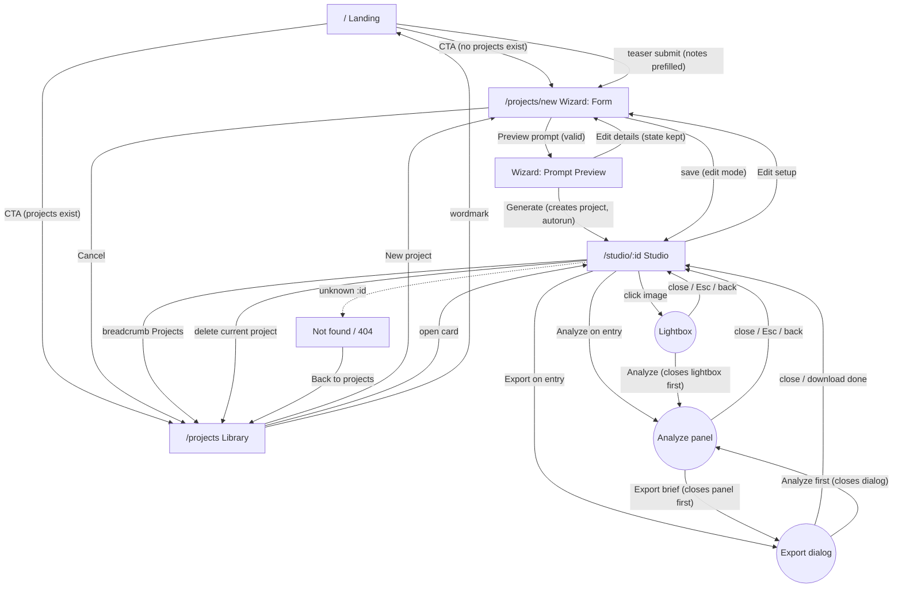

### Entry points (how users arrive at each screen)

| Screen | Entry paths |
|---|---|
| Landing | direct URL, wordmark from app shell |
| Library | landing CTA (returning), breadcrumb, wizard Cancel, post-delete redirect, not-found recovery |
| Wizard | landing CTA (first-run), teaser handoff, Library "New project", Studio "Edit setup" (edit mode), browser Back from Studio |
| Studio | wizard Generate, library card, direct URL / bookmark, History-tab deep link `?gen=` |

---

## 3. Decision Trees

### 3.1 Landing CTA routing (§10.4)

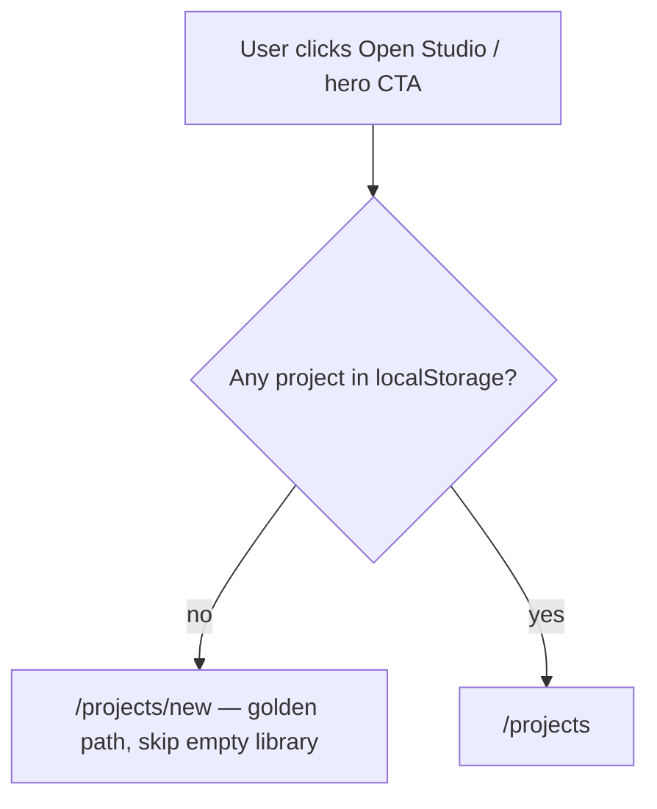

### 3.2 Wizard progression (§6.2)

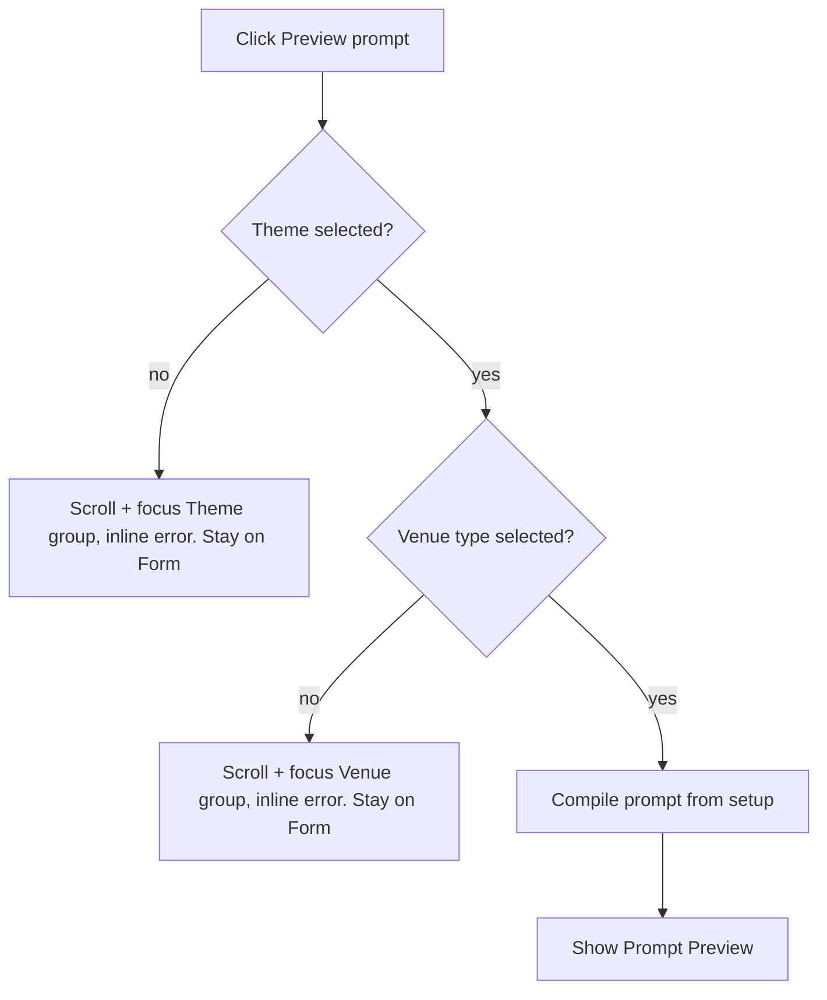

### 3.3 Prompt recompile conflict (§6.3)

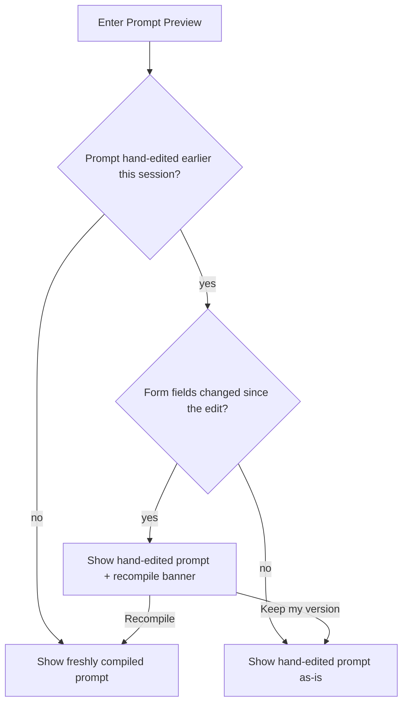

### 3.4 Generate request lifecycle (§7.2)

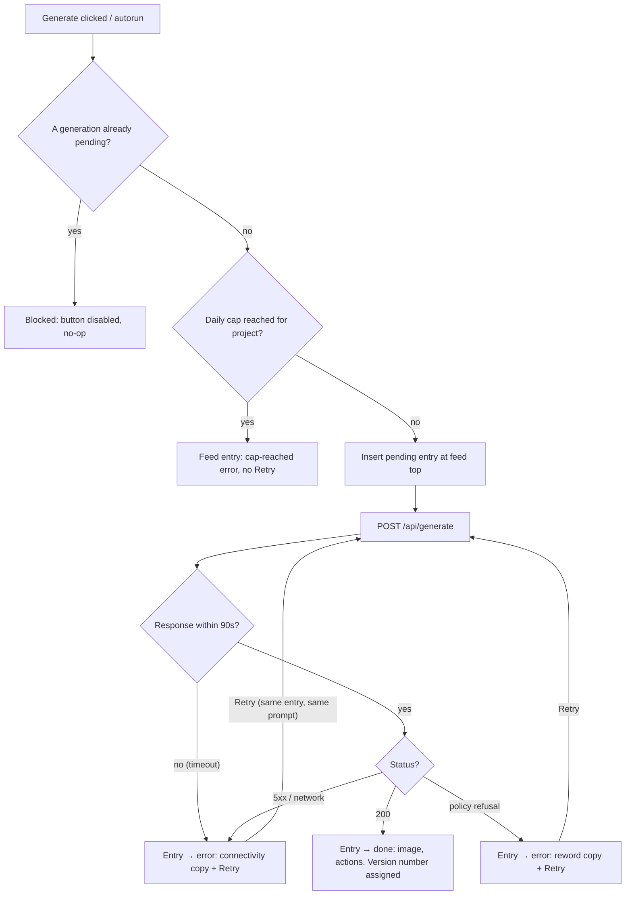

### 3.5 Analyze lifecycle (§8)

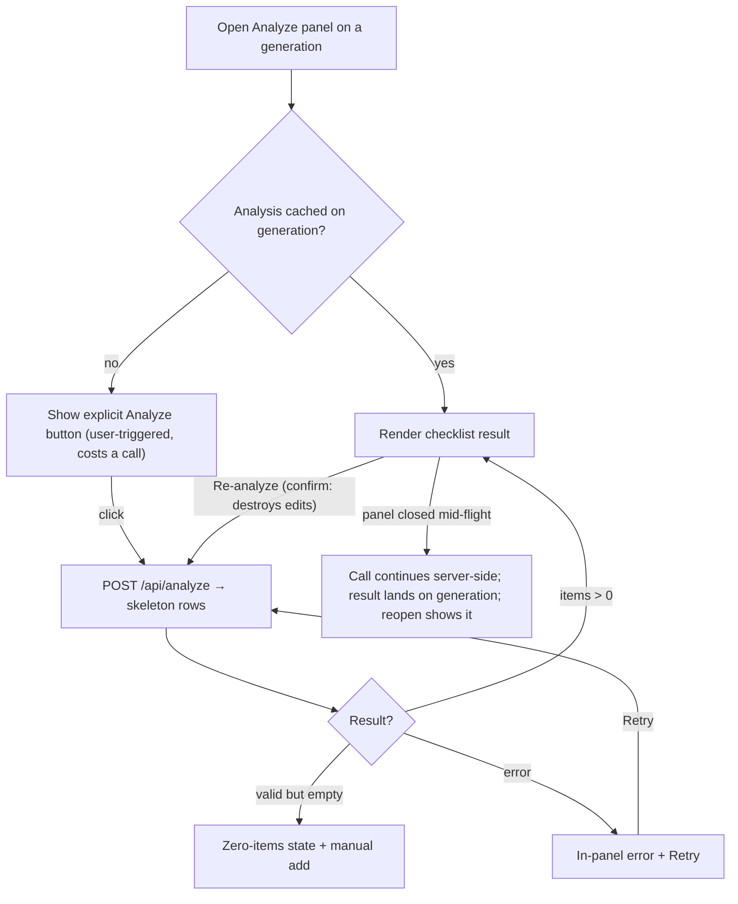

### 3.6 Export selection (§9)

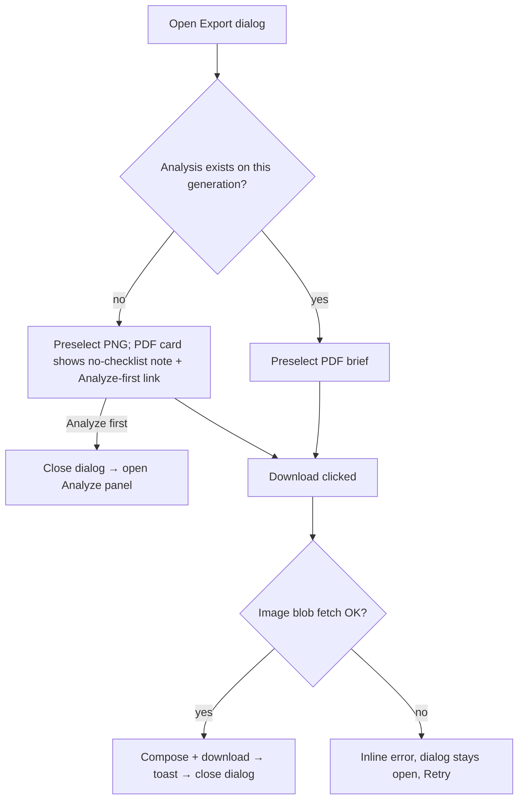

### 3.7 Project delete (§3.7)

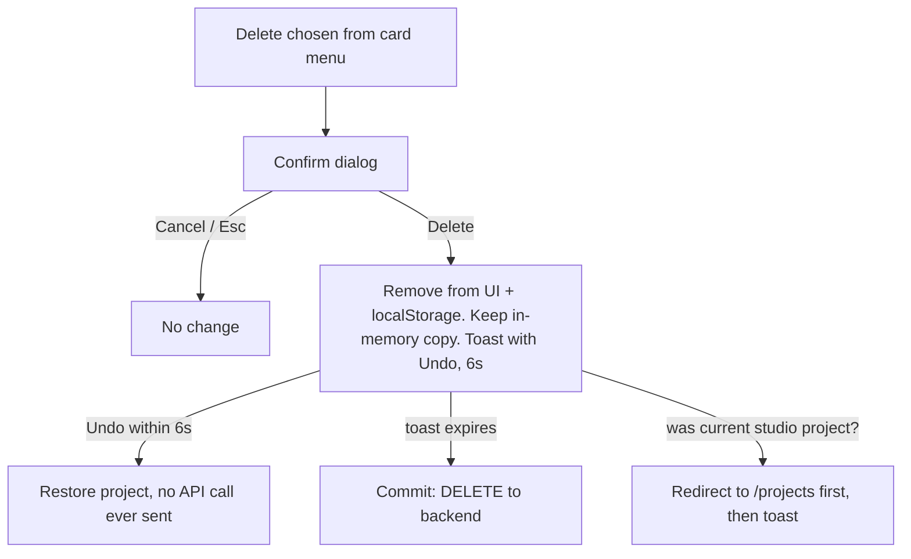

### 3.8 Data hydration on app load (§10.1)

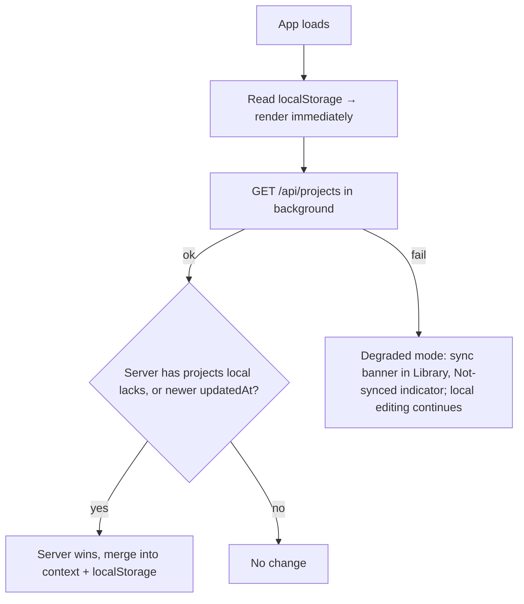

---

## 4. User Journeys

### 4.1 Golden path — first-time couple (Sari)

```mermaid
flowchart LR
    A["Landing"] --> B["Wizard: Form"] --> C["Prompt Preview"] --> D["Studio: pending entry"] --> E["Design 1 done"] --> F["Regenerate with note"] --> G["Design 2 done"] --> H["Analyze panel: checklist"] --> I["Edit checklist"] --> J["Export dialog: PDF"] --> K["Brief downloaded"]
```

Step detail:

| # | Screen/overlay | User action | System response |
|---|---|---|---|
| 1 | Landing | clicks hero CTA (no projects) | route → Wizard, blank form, name field focused |
| 2 | Wizard Form | picks Theme, Venue; skims defaults; adds note; clicks Preview | validation passes → Preview view slides in |
| 3 | Prompt Preview | reads compiled prompt, clicks Generate | project created (local + backend), route → Studio, autorun fires |
| 4 | Studio | waits | pending entry with elapsed counter; done at ~30s → Design 1 |
| 5 | Studio | types "make the backdrop taller", Cmd+Enter | new pending entry above Design 1 → Design 2 |
| 6 | Studio | clicks Analyze on Design 2 | panel opens, not-analyzed state; clicks Analyze → skeleton → checklist |
| 7 | Analyze panel | unchecks 2 items, adds a note | autosave; sync indicator blips |
| 8 | Analyze panel | clicks Export brief | panel closes, Export dialog opens, PDF preselected |
| 9 | Export dialog | clicks Download | preparing → file downloads → toast → dialog closes |

### 4.2 Returning organizer (Rina) — new client from an old concept

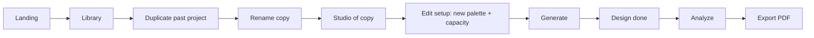

Key differences from 4.1: enters via Library (projects exist); duplicate carries setup + old generations as reference history; "Edit setup" reuses the Wizard in edit mode and returns to Studio; new generations use the updated setup, old designs remain in the feed untouched.

### 4.3 Live consultation (Rina, in a meeting, on a laptop)

1. Library → opens the client's project prepared earlier.
2. Generates 2–3 variations live, narrating between 30s waits (prompt expander lets her show *what* was asked).
3. Uses History tab to jump between candidate designs while the client compares.
4. Client picks one → Analyze on the spot → unchecks items the venue already provides.
5. Exports PNG (to AirDrop/WhatsApp the client immediately) — PDF comes later after checklist cleanup.

Flow implication: the feed must stay navigable while a generation is pending (scrolling old entries is never blocked), and Export PNG must work on a design that was never analyzed.

### 4.4 Teaser handoff (impulse visitor)

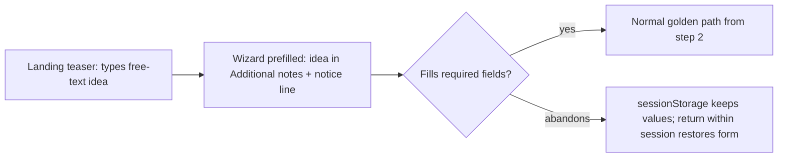

---

## 5. Alternative Flows

### 5.1 Regenerate loops (refinement)

- **Empty-note regenerate**: bottom bar empty + Generate → reruns the last-used prompt verbatim as a new entry. Legal and expected ("give me another take").
- **Note chaining**: each note appends to the *base compiled prompt*, not to the previous note (Design 3's note doesn't inherit Design 2's note). The entry's prompt expander always shows the full effective prompt, so the model of "notes don't stack" is inspectable. If a user wants stacking, they say so in a longer note — do not build note history composition.
- **Use as reference (P1)**: done entry → "Use as reference" → reference chip appears in bottom bar → next generation calls the edits endpoint. Removing the chip reverts to text-only generation. Only one reference at a time; setting a new one replaces the old (no confirm — chip swap is visible).

### 5.2 Edit setup mid-project

Studio → Setup tab → "Edit setup" → Wizard (edit mode, prefilled, breadcrumb shows project name) → save → back to Studio. Consequences surfaced to the user: none retroactive — a one-line note on return ("Updated setup applies to your next design"). If the prompt was hand-edited at creation, the recompile-conflict tree (3.3) runs on the edit-mode preview.

### 5.3 Deep links & refresh

| URL action | Behavior |
|---|---|
| Refresh on `/studio/:id` mid-generation | Pending entry restores from project JSON (`status: "pending"`); client re-polls `GET /api/projects/:id` every 5s until status resolves. If server marks error, entry shows error state. Never a phantom eternal spinner |
| Refresh on Wizard Form | sessionStorage restore (reference image may require re-add — §6.2) |
| Refresh with Analyze panel open | Panel state is not restored (it's UI state, not a route). Studio renders; analysis, if it completed server-side, is on the generation |
| `/studio/:id?gen=:gid` | Feed scrolls to that entry and flashes it; invalid `gid` silently ignored |
| Bookmarked project on a second browser | Project loads from backend (source of truth); localStorage on that browser adopts it |

### 5.4 Browser Back behavior

| Context | Back does |
|---|---|
| Studio (no overlay) | → Wizard Preview (completed state) if arrived via Generate; else previous screen |
| Studio with lightbox or Analyze panel open | closes the overlay (popstate intercepted), stays on Studio |
| Wizard Preview | → Wizard Form, values intact |
| Wizard Form (dirty) | leaves without confirm — sessionStorage means nothing is lost; no "unsaved changes" dialog exists anywhere in the app |

---

## 6. Edge Cases

Grouped by flow; each row states detection and resolution. Behaviors marked ⚠ need engineering enforcement, not just UI.

### 6.1 Generation

| # | Case | Behavior |
|---|---|---|
| G1 | Second Generate while pending | ⚠ UI disables button; server also rejects concurrent generation per project (409) → surfaced as the disabled state, never an error entry |
| G2 | Daily cap reached | Cap-reached entry (no Retry); bottom bar stays enabled — cap error only on attempt, since cap state can reset while the tab is open |
| G3 | Timeout at 90s but server eventually succeeds | Entry showed error; background poll (5.3) finds `done` → entry silently upgrades to done. Retry button, if already clicked, follows G1 concurrency rule |
| G4 | Policy refusal loops (user retries same refused prompt) | Same error each time; copy already says "try rewording". After 2 identical refusals, error copy appends "Editing your notes or theme usually fixes this." No hard block |
| G5 | Autorun fires twice (StrictMode / double-mount) | ⚠ Guard exists in current code pattern; keep idempotency: autorun consumes the navigation state so remounts don't re-trigger |
| G6 | User navigates away mid-generation | Generation continues server-side; project JSON gets the result; returning shows it via hydration |
| G7 | Prompt > model limit (giant hand-edited prompt) | Preview textarea caps at 2,000 chars with counter; server truncates defensively ⚠ |

### 6.2 Analysis & checklist

| # | Case | Behavior |
|---|---|---|
| A1 | Re-analyze after manual edits | Confirm popover warns edits are destroyed (3.5). Manual items (`isManual`) are **preserved** across re-analysis; only detected items are replaced |
| A2 | Analyze an error/pending generation | Impossible — Analyze action renders only on done entries |
| A3 | Vision returns malformed JSON | ⚠ Server retries once with a stricter instruction; if still bad → panel error state. Never render partial garbage |
| A4 | Checklist item edited in two tabs | Last-write-wins via storage events (§10.2); no conflict UI |
| A5 | All items unchecked, then Export PDF | Legal; brief renders "No items selected" under checklist heading rather than an empty section |

### 6.3 Projects & data

| # | Case | Behavior |
|---|---|---|
| P1 | Delete project open in another tab | Storage event removes it; other tab shows Not-found state on next interaction with a "Back to projects" path |
| P2 | Undo-delete after navigating away from Library | Toast is app-global; undo works from any screen while visible |
| P3 | Duplicate a project mid-generation | Copy excludes the pending generation (running state is not duplicated — plan.md); done generations copy |
| P4 | localStorage full / unavailable (private mode) | App runs backend-only; sync indicator permanently shows server mode; if backend also down → Library shows empty + banner. Degraded, not broken |
| P5 | Server has project, localStorage doesn't (new device) | Hydration merge (3.8) — server wins |
| P6 | Image file missing for done generation | Entry renders "Image unavailable" tile + retry; Analyze (cached) and prompt remain usable; Export PNG disabled for that generation, PDF renders without image + note |
| P7 | Project name collision on duplicate of a copy | "{name} (copy 2)" — increment, never overwrite |

### 6.4 Wizard

| # | Case | Behavior |
|---|---|---|
| W1 | Custom theme chip left empty after selecting Custom | Treated as no selection → required-field error on Preview |
| W2 | Reference image upload fails (size/type) | Inline error, form otherwise untouched; Generate later proceeds without reference |
| W3 | Edit-mode wizard for a deleted project (stale tab) | Save fails → route to Not-found state |
| W4 | Guest capacity typed as non-numeric | Input sanitizes to digits; blur clamps to [10, 5000] with helper note |

### 6.5 Export

| # | Case | Behavior |
|---|---|---|
| E1 | Download blocked by browser (popup/permission) | jsPDF uses same-gesture download; if it still fails, inline error with "Check your browser's download settings" |
| E2 | Very long checklist (>1 page) | PDF continues to page 2 for checklist only (§9.3) |
| E3 | Export while offline, image cached | PNG and PDF both succeed (blob from cache); no network required by design |

---

## 7. Screen Transitions

Timing/motion values live in ux-spec §1.4; this table defines **what transitions, when, and what persists**.

| From → To | Trigger | Transition | State carried |
|---|---|---|---|
| Landing → Wizard | CTA / teaser | route change, instant | teaser text → notes field |
| Landing → Library | CTA (returning) | route change, instant | — |
| Library → Studio | card click | route change, instant; Studio renders shell immediately, feed hydrates from local | projectId |
| Wizard Form ⇄ Preview | Preview / Edit details | horizontal slide 200ms (same route) | full form state, scroll position |
| Preview → Studio | Generate | route change after project create (<500ms button-loading) | project + autorun flag via navigation state; autorun consumed on mount (G5) |
| Studio → Wizard (edit) | Edit setup | route change | project setup prefill; return path |
| Studio ⇄ Lightbox | image click / Esc | fade 160ms | selected generation; focus returns to invoking image |
| Studio ⇄ Analyze panel | Analyze / Esc / ✕ | slide-over 240ms + dim | generationId; scroll position of feed preserved |
| Analyze → Export | Export brief | panel slides out, dialog scales in (sequential, ~150ms gap) | generationId, PDF preselected |
| Studio ⇄ Export dialog | Export / Esc / done | dialog 160ms | generationId |
| Any → Not-found | bad id | instant | — |
| Delete → Library | confirm on current project | route change, then toast | undo payload in memory |

Global transition rules:

1. **Route changes are instant** — no page-level fade/slide between routes. Motion is reserved for overlays and intra-route view swaps (wizard). The app should feel like a tool, not a slideshow.
2. **Nothing blocks navigation.** Pending generations, syncs, and analyses all survive leaving the screen; no "are you sure you want to leave" dialogs exist.
3. **Focus discipline on every transition**: overlays trap focus and return it to the invoking element; route changes move focus to the page `h1` (screen-reader announcement).
4. **Scroll restoration**: Library and Studio feed restore scroll on Back; Wizard always opens at top except validation-scroll (3.2).

---

## 8. Coverage Checklist

Every screen/overlay × required state, as a build/QA matrix. ✓ = specified above or in ux-spec; — = state cannot occur.

| Surface | Default | Loading | Empty | Error | Success/Done | Degraded |
|---|---|---|---|---|---|---|
| Landing | ✓ | — | — | — | — | — |
| Library | ✓ | ✓ skeletons | ✓ | ✓ banner | — | ✓ local-only |
| Wizard Form | ✓ | — | ✓ (=default) | ✓ inline | — | ✓ (image restore fail) |
| Prompt Preview | ✓ | ✓ button | — | ✓ (create fails → proceed local) | ✓ → Studio | ✓ |
| Studio feed | ✓ | ✓ pending entry | ✓ | ✓ per-entry ×3 types | ✓ done entry | ✓ image-missing |
| Bottom bar | ✓ | ✓ locked | — | ✓ cap | — | — |
| Analyze panel | ✓ not-analyzed | ✓ skeleton | ✓ zero-items | ✓ retry | ✓ checklist | ✓ close-mid-flight |
| Export dialog | ✓ | ✓ preparing | — | ✓ inline | ✓ toast | ✓ no-checklist PDF |
| Lightbox | ✓ | — | — | — | — | — |
| Not-found | ✓ | — | — | — | — | — |

Any cell a designer or engineer can't point to a spec section for is a gap — flag it before Figma, not after.
